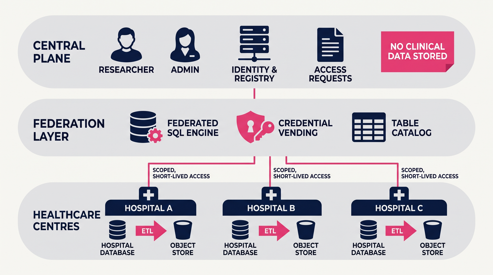
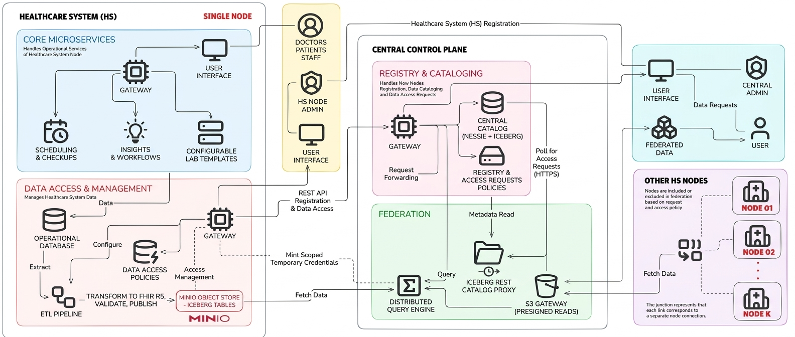

# Federated Data Lakes for Healthcare Centres

A federated data lake that lets an approved researcher run one SQL query across several
hospitals at once, without any hospital handing over a copy of its data.

Healthcare in Pakistan runs on disconnected systems, so there is no unified view for
research, planning or oversight. The usual fix is to copy everything into a central
warehouse, which asks every hospital to give up custody of its records. This project takes
the other route: the data stays on the hospital's own infrastructure, and what moves between
institutions is permission rather than records.

Each hospital keeps its own database and object storage, publishes its records as FHIR R5 in
an open table format, and decides who may read which parts. The central service holds only
identity, the hospital registry and access requests. On approval, a hospital issues short
lived credentials scoped to exactly what was approved. Queries run against the hospitals'
own storage and come back combined.

Every component is open source and runs under Docker, so a hospital can run its side on its
own hardware. It is a final year project, and the upstream clinical schema it ingests from
is modeled on Pakistani hospital records, using CNIC as the patient identifier.



## Overview

Three parties:

- **Hospital**: runs a node service, its own PostgreSQL and its own MinIO. Publishes its
  records as an Apache Iceberg table in its own bucket and answers access requests itself.
- **Central plane**: knows which hospitals exist, who is asking, and what was approved.
  Never sees the records.
- **Requestor**: asks named hospitals for named departments over a date range, and once
  approved can query exactly that and nothing more.

Trino executes the federated query. A proxy sits between Trino and the hospitals, resolving
which hospital and which grant each request belongs to, and re-signing every object read
against the right hospital's storage.

## What it does

- A hospital registers, is approved by an administrator, and gets its own catalog namespace.
- Its ETL pipeline reads the operational database on a schedule, converts each checkup into
  a FHIR R5 Bundle, validates it, and publishes an Iceberg table into its own object store.
  Records that fail validation go to a separate errors table rather than being dropped.
- A researcher registers, is approved, and submits a request naming hospitals, departments
  and a purpose.
- Each hospital answers independently. One request can be approved by one hospital and
  rejected by another, and stays usable for the approved part.
- On approval the hospital mints temporary storage credentials that can read only the
  approved departments and dates. They expire on their own.
- The researcher builds a query in the browser by picking approved access, departments,
  columns and dates. The server writes the SQL, fans it out, and returns one combined
  result.
- Reading outside the approval fails twice: the server refuses to build the query, and the
  credentials would not have permitted the read.

## Key technical ideas

### Turning an approval into a storage permission

"Cardiology and Radiology, for 2024" has to become something the storage system can enforce,
otherwise the guarantee is only as good as the application code in front of it.

The Iceberg table is partitioned by `department_name` and `checkup_date`, so the approved
scope is part of the object key:

```
iceberg/{namespace}/{table}/data/department_name=Cardiology/checkup_date=2024-03-11/...
```

On approval the node builds an IAM policy naming one resource ARN per approved department
and date, and calls MinIO's STS `AssumeRole` with it inline. The returned key physically
cannot read anything else. The partition layout was chosen for the authorization model, not
just for query performance.

### Fitting a grant into 2048 bytes

MinIO caps an inline STS policy at 2048 bytes. Two departments over a full year expands to
730 resource ARNs, far past the limit.

Before the ARNs are generated the date list is collapsed: a complete month becomes
`YYYY-MM-*`, a complete year becomes `YYYY-*`. Two departments over a year drops to two
ARNs. A wildcard is only used when every day in the period is included, so the collapsed
policy grants exactly what the expanded one would have. If a request still does not fit, the
approval is refused with a message to select whole months or a narrower range.

### Telling the proxy which grant a query belongs to

Trino connects to an Iceberg REST catalog with settings fixed at startup and cannot attach a
per query header. But two researchers can hold different grants over the same hospital, so
the proxy has to tell them apart on every request.

The identity rides in the one value the query controls, the schema name. The backend emits
`iceberg."hospital_abc123::AKIA...EXAMPLE"."checkups"` and the proxy splits the namespace on
`::` to recover the hospital and the access key, then matches on hospital, approved status
and that exact key. An unknown or revoked key gets a `403` from the catalog. The credential
decision stays inside the proxy, without patching Trino or giving up vended credentials.

### Reading objects through a tunnel

Trino signs object reads with SigV4, and a Cloudflare Tunnel sits between the proxy and each
hospital. Anything that rewrites an HTTP header invalidates a header based signature.

So the proxy does not forward Trino's signature. It resolves the grant, presigns the request
against the hospital's MinIO with a fifteen minute expiry, and strips `authorization`,
`x-amz-*` and `host` from the inbound request. The whole signature travels in the query
string, which no intermediary can break. Trino never holds a credential that works anywhere
except through the proxy.

### Never accepting SQL from a user

A cross-hospital query builder is one bad concatenation away from leaking a hospital that
never approved the researcher.

The API takes structure, not SQL: a table, a column list, a row limit, one selection per
hospital. Identifiers are checked against `^[a-zA-Z_][a-zA-Z0-9_]*$` and dates against
`^\d{4}-\d{2}-\d{2}$`. Every selection resolves to a stored approval, is checked for
ownership and status, and its departments must be a subset of the grant with dates inside
the granted range. Only then does the server assemble one `SELECT` per hospital and join
them with `UNION ALL`. No user text ever reaches Trino as SQL, and the authorization check
runs on the same object that supplies the storage credentials, so the two cannot drift.

### Pulling work instead of pushing it

The first design pushed new access requests to hospitals over RabbitMQ, which meant every
hospital had to hold an open connection to central infrastructure and run a broker for a
handful of messages a day.

Nodes now poll `GET /api/v1/nodes/requests` with their service token and deduplicate on the
central request ID, so a repeated poll is harmless. It removes a piece of infrastructure
from every deployment and turns an inbound connection into an outbound one, which is far
easier to get through a hospital network. The broker code is still in the tree, disabled.

## Architecture

The system splits along the trust boundary: everything that touches clinical data runs
inside the hospital, everything shared runs centrally and holds only metadata.

A query takes four hops. The central backend validates it against stored approvals and
builds the SQL. Trino asks the central proxy for the table, and the proxy answers as an
Iceberg REST catalog, looking the table up in Nessie and returning metadata plus the grant's
temporary credentials. Trino then issues object reads, which the proxy routes to the owning
hospital and presigns against its MinIO. The proxy is the only component that talks to more
than one hospital, and even it stores nothing it moves.



| Component | Responsibility |
|-----------|----------------|
| `central-backend` | Accounts and sessions, hospital registry, access requests, storage of vended credentials, server side query construction |
| `central-proxy` | Iceberg REST catalog over Nessie, credential vending to Trino, virtual S3 gateway that routes and presigns object reads |
| `central-web` | Admin dashboard and requestor portal, including the query builder |
| `node-backend` | Runs at the hospital: token handshake, request polling, STS credential minting, ETL scheduling |
| `node-web` | Hospital operator UI for node setup, ETL config, and approvals |
| `etl-server` | Stateless job runner that executes the Spark pipeline and reports stage progress |
| `hms-datalakes/hospital_etl` | PySpark pipeline: JDBC extraction, FHIR R5 transformation, validation, publication |
| `prisma` | Schema and seed data for the upstream hospital management system |
| Nessie | Versioned catalog holding Iceberg table pointers per hospital namespace |
| Trino | Executes the federated query across hospital namespaces |
| MinIO | One per hospital. Object storage plus the STS endpoint that issues scoped credentials |

Details in [docs/architecture.md](docs/architecture.md).

## Technology stack

| Area | Technology |
|------|------------|
| Backend services | Go, Gin, GORM, logrus |
| Authentication | JWT (`golang-jwt/v5`), bcrypt, httpOnly cookie sessions, shared internal API keys |
| Object storage and credentials | MinIO, AWS SDK for Go v2 (S3, STS, presigning) |
| Table format and catalog | Apache Iceberg, Project Nessie (Core API v2) |
| Query engine | Trino 464, `trino-go-client` |
| Data pipeline | PySpark 3.5, PostgreSQL JDBC, `fhir.resources` with pydantic for FHIR R5 validation |
| Databases | PostgreSQL for the central plane, each node, and Nessie's version store |
| Frontends | Next.js 14 App Router, React 18, TypeScript, Tailwind CSS, Radix UI |
| Upstream schema | Prisma 7 |
| Infrastructure | Docker Compose, Cloudflare Tunnel, Heroku |

## Running the project

```bash
# Central plane: PostgreSQL x3, Nessie, central-proxy, Trino
cp .env.example .env
docker compose up -d

# Hospital side: source PostgreSQL, MinIO, buckets, etl-server
cp .env.etl.example .env.etl
docker compose -f docker-compose.etl.yml --env-file .env.etl up -d

# Application services, each in its own terminal from the repository root
(cd central-backend && go run ./cmd/server)          # 8080
(cd node-backend    && go run ./cmd/server)          # 9090
(cd central-web/app && npm install && npm run dev)   # 3000
(cd node-web        && npm install && npm run dev)   # 3001
```

Then seed the hospital's source database from `prisma/` and register a hospital in the admin
dashboard. Requires Docker, Go 1.25 or newer, and Node.js 18 or newer. Java, Python and
Spark are only needed inside the `etl-server` image, which builds from the repository root
because it copies the pipeline scripts out of `hms-datalakes/`. The Go services and
frontends are commented out in `docker-compose.yml` and run from source, which is how they
were developed.

The full walkthrough, from hospital registration to a federated query, is in
[docs/setup.md](docs/setup.md).

## Configuration

Every Go service reads its configuration from the environment, loading a `.env` file if
present, and each lists every key with its default in `internal/config/config.go`.
`.env.example` and `.env.etl.example` cover the two Docker stacks. Two things to know:

- `PROXY_INTERNAL_API_KEY` on the central backend must match `INTERNAL_API_KEY` on the
  proxy, and `ETL_INTERNAL_API_KEY` must match between the node backend and the ETL server.
  An empty key makes the middleware allow all requests, which is for local development only.
- A hospital's MinIO endpoint, credentials, bucket, Nessie namespace and ETL schedule are
  not environment variables. They are entered in `node-web` and stored in the node's own
  database, because each hospital configures its own storage.

## Project structure

| Path | Contents |
|------|----------|
| `central-backend/` | Central control plane. Handlers, middleware, services including the query builder, GORM models |
| `central-proxy/` | Iceberg REST catalog, S3 router, credential and Trino services |
| `central-web/` | Next.js requestor portal and admin dashboard, plus a static admin page served by the backend |
| `node-backend/` | Hospital node service. STS policy building, request sync, ETL scheduling |
| `node-web/` | Next.js hospital operator UI |
| `etl-server/` | Go job runner and its combined Go, Python and Spark image |
| `hms-datalakes/hospital_etl/` | PySpark pipeline scripts and MinIO policies |
| `prisma/` | Upstream hospital management schema and seed data |
| `trino/`, `local-infra/`, `nessie-heroku/` | Trino catalog and node config, the tunneled local stack, the Nessie deployment image |
| `docs/` | Architecture, setup, ETL pipeline, requestor API reference |

## Engineering highlights

- An Iceberg REST catalog written from scratch in Go on top of Nessie, including table
  resolution through the Core API v2, metadata fetch and rewriting, and credential vending
  in the `LoadTable` response.
- A partition layout designed backwards from the authorization model, so a grant becomes an
  S3 resource policy instead of a filter in application code.
- Date range collapsing that keeps generated IAM policies inside MinIO's 2048 byte inline
  limit without widening what they grant.
- A virtual S3 gateway that resolves the owning hospital per request and presigns reads, so
  object access survives header rewriting intermediaries.
- Structured query construction with identifier allowlists and subset checks against stored
  approvals, so no user supplied text reaches the query engine as SQL.
- Service to service authentication with a client credentials grant and stored node tokens
  refreshed five minutes ahead of expiry, separate from browser cookie sessions.
- A three stage Spark pipeline that validates FHIR R5 bundles per partition and keeps
  rejects in a parallel errors table, so one bad record does not fail a run.
- Unit tests over the parts where a mistake would be least visible: policy generation, date
  range collapsing, namespace parsing, the S3 router, and the query builder.

## Further documentation

- [docs/architecture.md](docs/architecture.md): components, approval path, query path,
  credential mechanics
- [docs/setup.md](docs/setup.md): running the whole system locally, end to end
- [docs/etl-pipeline.md](docs/etl-pipeline.md): Spark stages, FHIR output, ETL server API
- [docs/requestor-api.md](docs/requestor-api.md): the requestor facing HTTP API

## Project status

The federated query path works end to end: a hospital publishes an Iceberg table into its
own storage, approves a scoped request, and a researcher queries exactly that scope through
Trino and the proxy. The central plane, the node service and its UI, the ETL pipeline and
both frontends are implemented. The stack has been run locally under Docker Compose and
deployed with Heroku, a hosted PostgreSQL, and a Cloudflare Tunnel fronting the hospital
side.

It is a research and demonstration system rather than a clinical deployment, and work
continues on the operational side.
